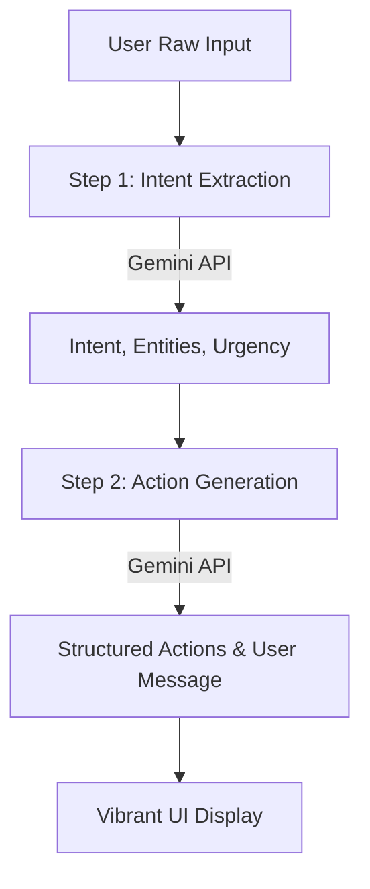

# IntentBridge AI 🧠

**Turn chaos into clarity.**

IntentBridge AI is a powerful tool designed to process messy, real-world inputs and transform them into structured, validated, and actionable outputs using the Google Gemini API. Whether it's a panicked tech support request or a complex set of instructions, IntentBridge detects the intent, urgency, and entities to provide a clear path forward.

---

## 🚀 Features

- **Intent Recognition**: Automatically identifies the primary goal of the user's input.
- **Urgency Detection**: Classifies requests based on priority (e.g., critical, high, medium, low).
- **Actionable Steps**: Generates a list of concrete tasks to resolve the situation.
- **Structured Output**: Provides clean JSON responses ready for integration.
- **Modern UI**: A sleek, responsive React interface with voice and image input support.

---

## 🛠️ Tech Stack

- **Frontend**: React 18, Vite, Vanilla CSS
- **Backend**: FastAPI (Python 3.10+)
- **AI Engine**: Google Gemini API (model: `gemini-1.5-flash`)
- **Tooling**: Node.js, npm, pip, Uvicorn

---

## 🏗️ Project Structure

```bash
.
├── backend/            # FastAPI Backend
│   ├── routes/         # API Endpoints
│   ├── services/       # Gemini AI Integration (Two-step pipeline)
│   ├── schemas/        # Pydantic (Request/Response) Models
│   └── main.py         # App Entry Point (CORS Enabled)
├── frontend/           # React Frontend (Vite)
│   ├── src/            # Components & Application Logic
│   └── index.html      # Main HTML
└── prompts/            # AI Prompt Templates & Documentation
```

---

## 🧠 How it Works

IntentBridge uses a **Two-Step AI Pipeline** to ensure accuracy and reliability.



1. **Extraction**: The first step analyzes the raw input to understand *what* the user wants and *how urgent* it is.
2. **Execution**: The second step takes those parameters and generates *concrete*, *actionable* steps like creating calendar events, sending emails, or setting reminders.

---

## ⚡ Quick Start

### 1. Prerequisites
- Python 3.10+
- Node.js & npm
- Google Gemini API Key

### 2. Backend Setup
```bash
cd backend
python -m venv venv
source venv/bin/activate  # On Windows: venv\Scripts\activate
pip install -r requirements.txt
cp .env.example .env
# Edit .env and add your GEMINI_API_KEY
uvicorn main:app --reload --port 8000
```
API Documentation will be available at: `http://localhost:8000/docs`

### 3. Frontend Setup
```bash
cd frontend
npm install
npm run dev
```
The application will be available at `http://localhost:5173`.

---

## 🔌 API Documentation

### `POST /api/process`
Processes raw input to return structured data.

**Request Body:**
```json
{
  "input": "My laptop won't turn on and I have a presentation in 10 minutes!"
}
```

**Successful Response:**
```json
{
  "intent": "emergency tech support",
  "urgency": "high",
  "user_message": "I'll help you troubleshoot your laptop immediately.",
  "actions": [
    {
      "description": "Perform a hard reset (hold power button for 30s)",
      "type": "task",
      "priority": "high"
    },
    {
      "description": "Check power cable and battery status",
      "type": "task",
      "priority": "high"
    }
  ]
}
```

---

## 📝 License
MIT License. Created for **WarmUp-PromptWars**.

